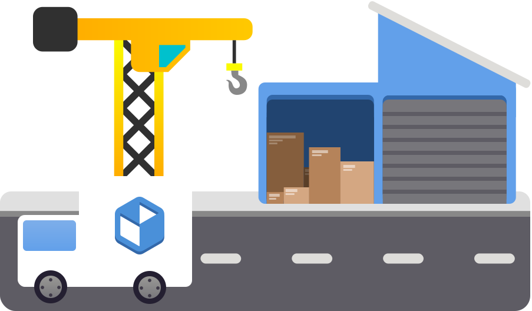

# 🛠️ Warehouse



## Warehouse is a versatile toolbox and provides a simple UI to control complex Flatpak options, all without resorting to the command line.

## 🚀 Main Features:

1. **Viewing Flatpak Info:** 📋 Warehouse can display all the information provided by the `Flatpak list` command in a user-friendly graphical window. Each item includes a button for easy copying.

2. **Change Package Versions:** ↕️ Rollback any unwanted updates of any package, so long as the remote has older versions.

3. **Managing User Data:** 🗑️ Flatpaks store user data in a specific system location, often left behind when an app is uninstalled. Warehouse can uninstall an app and delete its data, delete data without uninstalling, or simply show if an app has user data.

4. **Batch Actions:** ⚡ Warehouse features a batch mode for swift uninstallations, user data deletions, and app ID copying in bulk.

5. **Leftover Data Management:** 📁 Warehouse scans the user data folder to check for installed apps associated with the data. If none are found, it can delete the data or attempt to install a matching Flatpak.

6. **Manage Remotes:** 📦 Installed and enabled Flatpak remotes can be deleted, and new remotes can be added.

7. **Make Snapshots:** 🕐 Copy app user data to take quick backups before doing anything risky with your data.

## ⏬ Installation:

Warehouse is now available on Flathub! Visit your software store and search for Warehouse, or click this badge.

<a href=https://flathub.org/apps/io.github.flattool.Warehouse></a>

## 🗣️ Translation
- Translation is hosted with Weblate on Fyra Labs, [click here](https://weblate.fyralabs.com/projects/flattool/warehouse/) to contribute

<a href="https://weblate.fyralabs.com/engage/flattool/">

</a>

## 💬 Get in Contact
- We have a [Discord Server](https://discord.gg/Sq85C42Xkt) and a [Matrix Space](https://matrix.to/#/#warehouse-development:matrix.org) to discuss and send announcements in!
- You can always open issues, PRs, and use other GitHub features here

## 📜 Code of Conduct
- The Warehouse project follows the [GNOME Code of Conduct](https://conduct.gnome.org/). See `CODE_OF_CONDUCT.md` for more information.

## ℹ️ Important Notes:
- Warehouse assumes Flatpak user data is located in the default directory: `~/.var/app`.
- Warehouse does not aim to replace Flatpak; it simply facilitates appropriate Flatpak commands for the desired actions.
- This project is still in its early stages, developed by a newcomer. Your understanding of potential bugs is greatly appreciated.

## 🛠️ Installation from Repo Steps:

1. Visit the [releases](https://github.com/flattool/warehouse/releases) page and download `io.github.flattool.Warehouse.Flatpak`.
2. Install it using your software store or run the following command:
   ```shell
   flatpak install /path/to/io.github.flattool.Warehouse.flatpak
   ```
You're all set! Launch the application by clicking its icon in your app menu or running:
```shell
flatpak run io.github.flattool.Warehouse
```

## 👥 Contributing

### Compiling from Source

Make sure `flatpak` and `git` are installed, then run the following to build from the repo:
```bash
# Clone this repo and enter it
git clone https://github.com/flattool/warehouse
cd warehouse

# Install build dependencies
flatpak install org.flatpak.Builder org.gnome.Sdk//47 org.gnome.Platform//47 -y

# Build and install Warehouse
flatpak run org.flatpak.Builder _build ./build-aux/io.github.flattool.Warehouse.json --install --user --force-clean

# Run Warehouse
flatpak run io.github.flattool.Warehouse//master
```

### Formatting

Warehouse uses [pre-commit](https://pre-commit.com/) for code formatting.
- Install using `pip install pre-commit`
- Run `pre-commit install` in the Warehouse repository root to set up pre-commit for this repo.
- Run `pre-commit run --all-files` to format all files in the repository.

If you run into a situation where pre-commit is broken, you can use `git commit --no-verfiy` to skip the pre-commit checks.
